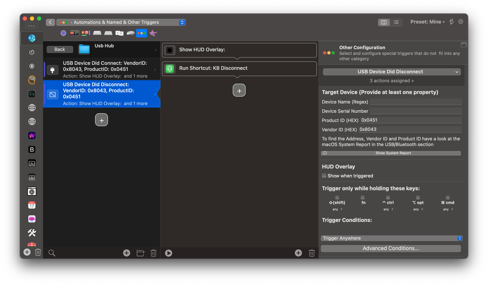

# Auto pair (Apple Magic keyboard 2) for windows & mac

am using a usb hub to watch its connection status and based on that i connect/disconnect the keyboard.
however the triggers can still be executed manually for both `win & mac`

# Mac:

- install https://folivora.ai/
- install https://github.com/toy/blueutil
- import included [shortcuts](mac) & update the `MAC_ADD`
- add 2 triggers to BTT for when usb hub is connected/disconnected

- now we have automated the (pair/unpair & connection) on mac

 

# Win:

- install https://bluetoothinstaller.com/bluetooth-command-line-tools
- use `btdiscovery -s` to get (service UUID & MAC_ADD)
- create 2 batch files with the cmnds to pair/unpair the keyboard
- {{batch files here + watcher script}}

- run on login via Task Scheduler
    - Open Task Scheduler
    - Create Basic Task :
  Name: USB Watcher
  Trigger: When I log on
  Action: Start a Program
  Program/script: `powershell.exe`
  Add arguments: `-WindowStyle Hidden -ExecutionPolicy Bypass -File "C:\Tools\usb_watcher.ps1"`
    - Finish, then open the task properties:
        - Go to the General tab
            - Check `Run with highest privileges`
            - Set Configure for to your OS version (e.g., Windows 10 or 11)
            - Optionally change the user account if needed
        - In the Settings tab, make sure:
            - "Allow task to be run on demand" is enable
            - "Stop the task if it runs longer than..." → unchecked (or extended)
