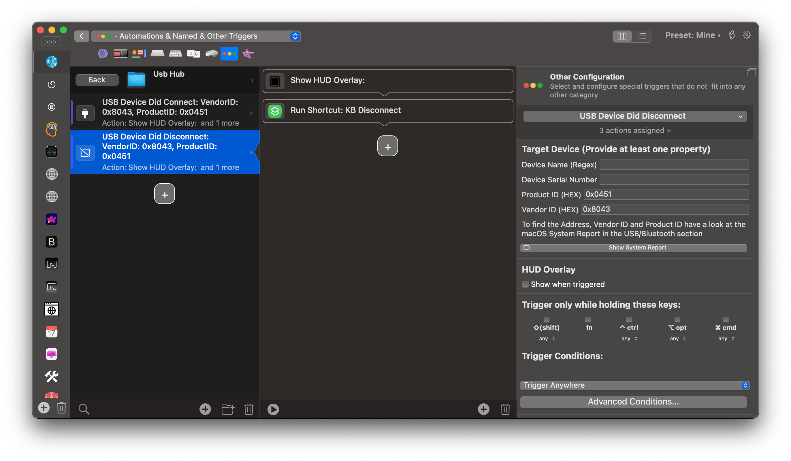

# Auto pair (Apple Magic keyboard 2) for windows & mac

am using a usb hub to watch its connection status and based on that i connect/disconnect the keyboard.
however the triggers can still be executed manually for both `win & mac`

# Mac:

- install https://folivora.ai/
- install https://github.com/toy/blueutil
- import included [shortcuts](mac) & update the `MAC_ADD`
- add 2 triggers to BTT for when usb hub is connected/disconnected

- now we have automated the (pair/unpair & connection) on mac

 

# Win:

- install https://bluetoothinstaller.com/bluetooth-command-line-tools
- download https://usbdeview.com/
- open `cmd` or `powershell` & run `btdiscovery -s` to get (service UUID & MAC_ADD)
- update the (batch + script files) [here](win) with the correct info you got from previous step
- next to automate script running via Task Scheduler
    - Open Task Scheduler
    - Create Basic Task :
        - Name: USB Watcher
        - Trigger: When I log on
        - Action: Start a Program
        - Program/script: `powershell.exe`
            - Add arguments: `-WindowStyle Hidden -ExecutionPolicy Bypass -File "path\to\UsbHubWatcher.ps1"`
    - Finish, then open the task properties:
        - Go to the General tab
            - Check `Run with highest privileges`
            - Set Configure for to your OS version (e.g., Windows 10 or 11)
            - Optionally change the user account if needed
        - In the Settings tab, make sure:
            - "Allow task to be run on demand" is enable
            - "Stop the task if it runs longer than..." → unchecked (or extended)

### PS:

for security reasons, the keyboard needs to be paired to windows using a code on first time, 
so unfortently you will have to do it manually using the "Bluetooth > add device",
but to get around that, make sure to follow this [steps](https://superuser.com/a/1742818/864280)
